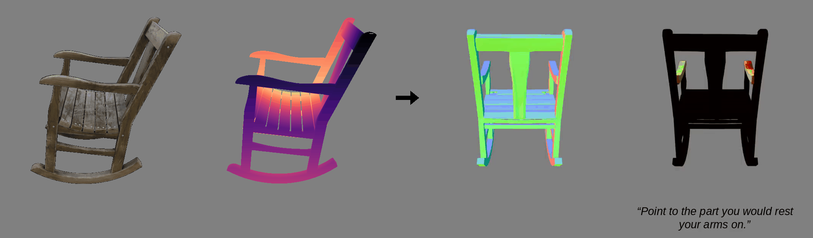

# Affostruction

Official code and data for:

>[Affostruction: 3D Affordance Grounding with Generative Reconstruction](https://arxiv.org/abs/2601.09211)\
> [Chunghyun Park<sup>1</sup>](https://chrockey.github.io/),
> [Seunghyeon Lee<sup>1</sup>](https://llishyun.github.io/), and
> [Minsu Cho<sup>1,2</sup>](http://cvlab.postech.ac.kr/~mcho/)<br>
> <sup>1</sup>POSTECH and <sup>2</sup>RLWRLD<br>
> CVPR 2026, Denver.

<div align="left">
  <a href="https://arxiv.org/abs/2601.09211"></a>
  <a href="https://chrockey.github.io/Affostruction/"></a>
  <a href="https://huggingface.co/chrockey/Affostruction"></a>
</div>

<p align="center">
   reconstruction + affordance" width="100%"/>
</p>
<p align="center"><em>"Reconstruct what's hidden, ground where to interact."</em></p>

## Installation

Requires Linux x86_64 + CUDA 12.4.

```bash
curl -LsSf https://astral.sh/uv/install.sh | sh
uv sync
```

Prefix commands with `uv run`; no venv activation needed.

## Pretrained checkpoints

Auto-downloaded from [`chrockey/Affostruction`](https://huggingface.co/chrockey/Affostruction) on first run. SLAT + mesh/gaussian decoders come from [`microsoft/TRELLIS-image-large`](https://huggingface.co/microsoft/TRELLIS-image-large).

| Model | Description | # Params |
|-------|-------------|---------:|
| `reconstruction` | Multi-view RGBD sparse-structure flow | 164.6 M |
| `affordance` | Text-conditioned affordance heatmap flow | 185.4 M |

## Usage

```python
from affostruction import AffostructionPipeline

pipeline = AffostructionPipeline.from_pretrained().cuda()
outputs = pipeline.run(input_dict, queries=["Point to the part you would sit on."])

coords = outputs["coords"]                  # (N, 4) sparse voxel coords
probs  = outputs["affordance"][0]["probs"]  # (N,) per-voxel heatmap in [0, 1], paired with coords
```

```bash
uv run python examples/affostruction.py --data_dir examples/data/sample2
```

> **Need mesh / gaussian?** Pass `formats=["mesh", "gaussian"]` — decoding is opt-in.
>
> **Reconstruction only?** Drop `queries`. See `examples/reconstruction.py` for more details.

## Acknowledgments

Built on [TRELLIS](https://github.com/microsoft/TRELLIS) by Microsoft.

## Citation

```bibtex
@inproceedings{park2026affostruction,
  title={Affostruction: 3D Affordance Grounding with Generative Reconstruction},
  author={Park, Chunghyun and Lee, Seunghyeon and Cho, Minsu},
  booktitle={Proceedings of the IEEE/CVF Conference on Computer Vision and Pattern Recognition (CVPR)},
  year={2026}
}
```
